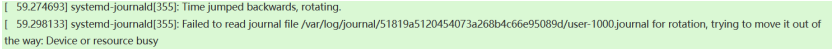
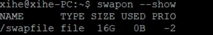
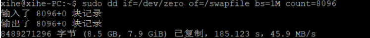
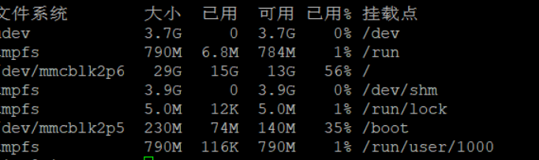

### Deepin 系统在RISC-V设备 LicheePi 3A 运行测试笔记（cdimage ver.20240913）

这是一份对 Deepin 操作系统在 RISC-V 设备 LicheePi 3A 上运行情况的基础测试记录

主要内容包括：工具准备、开机情况、桌面使用测试及开启 swapfile 后遇到的无法进入图形界面的处理记录

## 一、工具准备

**实体工具**

<ul>
<li>设备： LicheePi 3A </li> 
  板卡介绍 :
  https://wiki.sipeed.com/hardware/zh/lichee/K1/lpi3a/1_intro.html
<li>串口调试工具：RV DebuggerPlus </li>
连接方法参考 sipeed 文档:
  https://wiki.sipeed.com/hardware/zh/lichee/K1/lpi3a/4_peripheral.html
  
<li>电源适配器</li>
<li>USB连接线</li>
</ul> 

**软件工具**

镜像:[deepin-23-beige-preview-riscv64-k1-20240913](https://ci.deepin.com/repo/deepin/deepin-ports/cdimage/latest/riscv64/)

(注：即 deepin-ports/cdimage/latest/riscv64 下, k1 的 latest 版本）

uboot-k1工具：[下载](https://ci.deepin.com/repo/deepin/deepin-ports/cdimage/latest/riscv64/bootloaders/)

镜像烧录可使用[Titan Flasher](https://cloud.spacemit.com/prod-api/release/download/tools?token=titantools_for_windows_X86_X64)工具进行烧录
过程可参考前一篇安装笔记: [传送门](https://github.com/seig000/Test-for-Installing-Deepin-on-LicheePi-Module-3A/)

## 二、开机

正常烧录成功开机，通过putty软件串口查看开机日志中存在部分FAILED：

*初次开机，未对软件包进行更新的情况下，开机在桌面中会出现多个 Tray Plugin Crashed 提示，对软件包进行更新后续开机提示消失

## 三、桌面操作

**桌面使用**：

鼠标光标存在轻微闪烁情况，在资源管理文件夹窗口、应用窗口界面较为明显

窗口操作基本正常

壁纸可正常更换、个性化桌面可正常设置

**音频播放**：

声音使用板卡 3.5mm 音频口输出

本地音频播放情况：轻微卡顿，置于后台时卡顿明显

**浏览器播放**

Firefox 版本 131.0.3-1deepin1 riscv64
视频播放： bilibili 视频播放画面卡顿严重，出现音频正常播放画面停顿的现象

**办公软件使用**

libreoffice 版本 4：24.2.0-1deepin2 riscv64
卡顿较为严重，其中 libreoffice write 软件工具栏出现持续性闪烁现象

## 四、其它

进行系统更新过程中，更新进度一直卡在 70% 无法完成更新，故所有测试仅基于更新了软件包的基础上，未对该镜像所装系统进行更新，可能存在一定版本落后问题

另：记录一个在使用过程中遇到的一个问题

**问题描述** 

在更新过软件包并且添加 swap 文件（swap 文件添加方法参考[Deepin论坛帖子](https://bbs.deepin.org/post/236642),可不进行帖子中“第七步”）后，图形界面开机后在用户登录界面输入用户密码按下 enter 之后无法正常进入图形桌面端，强制进行uboot重启进程，重启后出现用户登录界面，循环
使用串口工具从命令行进行进行检查，输入密码可以正常进入系统但出现如下报错内容：

**问题处理记录**

考虑可能是因为板卡内存较小，所设置的 swap 文件较大，导致内存不足，从而出现了日志占用、打不开桌面端的问题

swapfile size :16G

检查空间占用情况：

尝试缩小一下 swapfile 大小

检查空间占用情况

重新启动，可以正常进入桌面了，串口命令行界面也没有出现日志信息报错了

